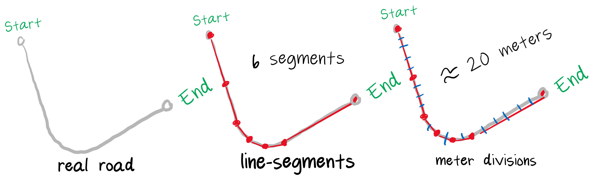

# geospatialsimulator
> A C# IoT geolocation simulator

The simulator will traverse a route, given orgin/dest as two geopoints.  In this example, the lambda will be invoked every 5 seconds with current simulation state of the vehicle.  You may modify the lambda to send events to whatever you like; console, event hub, service bus, etc.  The provided example acts as an IoT device sending events to Azure IoT Central.

v.Speed is in meters/s, the times 3.6 converts it into kilometers/h.  The telemetry is then sent on 
to IoT central using the azure DeviceClient library.

```csharp
          Task consumer = new Vehicle(drivingRoute).StartTrip(async (IoTState v) =>
            {
                var telemetryDataPoint = new
                {
                    Location = new { lon = v.Longitude, lat = v.Latitude },
                    Speed = v.Speed * 3.6M
                };
                var messageString = JsonConvert.SerializeObject(telemetryDataPoint);
                var msg = new Message(Encoding.UTF8.GetBytes(messageString));
                System.Console.WriteLine(messageString);
                await deviceClient.SendEventAsync(msg);
            }, 5);
```

The simulator uses Azure Maps as a route source.  The Azure Maps route api returns a set of line segments trace real life roads and highways.  Normally that data is intended for showing a driver the route superimposed on a road map, however, the simulator takes that same information and "traces" the lines with geo coordinates.



In the above diagram you can see how the real roadway is represented as a set of line-segments.  Just as with computer graphics, it can only represent the curvature at some granularity.  Given the line-segments the simulator further divides them into meters, so that the simulation can produce geo coordinates with respect to some speed (meters per second).  