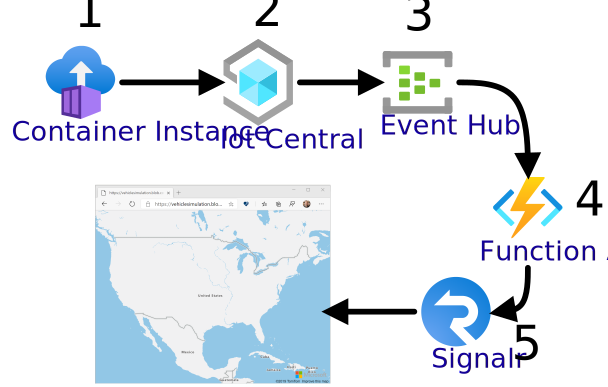

This tutorial will walk you through the creation 

### Sign in to Azure

Sign in to the [Azure portal](https://portal.azure.com) with your Azure account.

### Create an IoT Central Application for your simulation
1. follow [these instructions to build a custom IoT Central Application](https://docs.microsoft.com/en-us/azure/iot-central/core/quick-deploy-iot-central).
### Add a device capability model.  
Our simulated device will send Location and Speed information.
1. select Device Template -> "+"

2. Choose "IoT Device" for template type.  Do not choose IoT Edge or the plug and play models.

